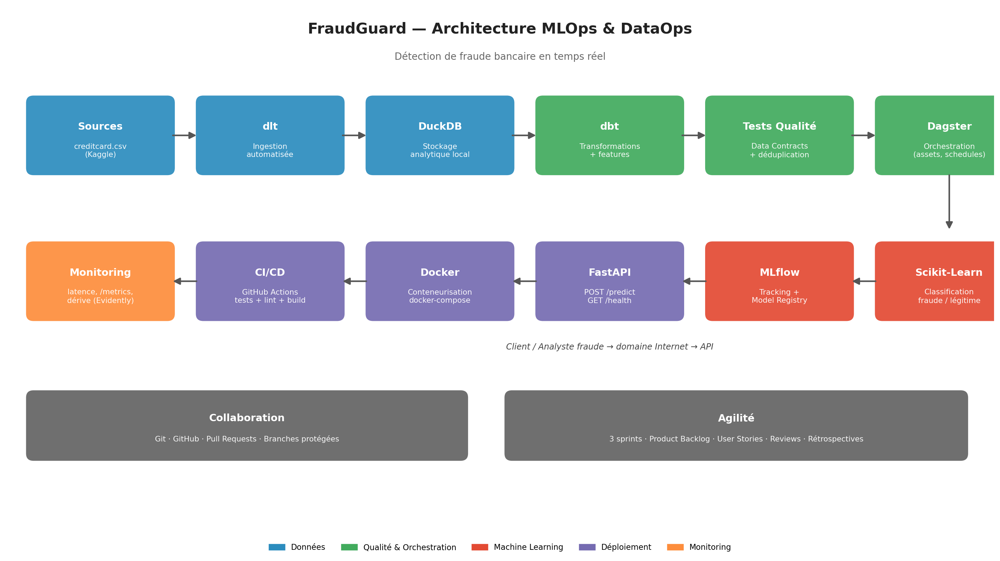
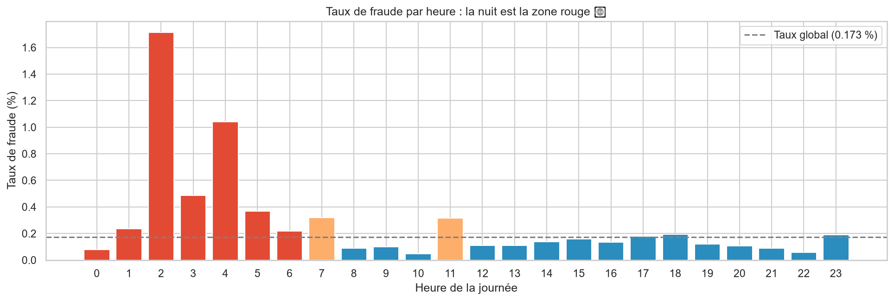

# 🛡️ FraudGuard — Détection de fraude bancaire en temps réel


> Pipeline **MLOps & DataOps** complet et industrialisé : de l'ingestion automatisée des
> transactions bancaires jusqu'au déploiement d'une API de détection de fraude en temps
> réel, avec monitoring et détection de dérive.

**Projet intégrateur — Module MLOps & DataOps — Pr. Mohammed AIT DAOUD**

---

## 📌 Problématique

La fraude à la carte bancaire coûte des milliards chaque année. Le défi : détecter
automatiquement les transactions frauduleuses **en temps réel**, alors qu'elles ne
représentent que **0,17 %** des transactions (une aiguille dans une botte de foin).

FraudGuard transforme des données brutes de transactions en un **service de prédiction
industrialisé, fiable et maintenable**, exposé via une API accessible sur Internet.

## 🏗️ Architecture



```
Sources de données → dlt (ingestion) → DuckDB (stockage) → dbt (transformations)
      → Tests qualité / Data Contracts → Dagster (orchestration)
      → Machine Learning (Scikit-Learn) → MLflow (tracking & registry)
      → FastAPI (service ML) → Docker (conteneurisation)
      → CI/CD (GitHub Actions) → Monitoring & Observabilité
```

## 🛠️ Stack technique

| Étape | Outil | Rôle |
|---|---|---|
| Ingestion | **dlt** | Chargement automatisé et incrémental des transactions |
| Stockage | **DuckDB** | Base de données analytique locale |
| Transformation | **dbt** | Nettoyage, features, tests qualité, data lineage |
| Orchestration | **Dagster** | Planification et dépendances du pipeline |
| Machine Learning | **Scikit-Learn** | Classification fraude / légitime |
| Tracking | **MLflow** | Expérimentations, métriques, Model Registry |
| Serving | **FastAPI** | API `POST /predict`, `GET /health`, `GET /metrics` |
| Conteneurisation | **Docker** | Déploiement reproductible |
| CI/CD | **GitHub Actions** | Tests, lint et build automatiques |
| Monitoring | **Evidently + logs** | Latence, disponibilité, dérive des données |

## 📊 Résultats de l'EDA (Sprint 1) ✅

Analyse exploratoire réalisée sur le dataset réel **Credit Card Fraud Detection**
(Kaggle — 284 807 transactions) : voir [`01_eda_fraude_v2.ipynb`](01_eda_fraude_v2.ipynb)

Principales découvertes :

- **Déséquilibre extrême** : 492 fraudes seulement (0,173 %) → SMOTE / `class_weight`
  obligatoire, évaluation par précision, rappel, F1 et AUC-ROC
- **1 081 doublons** détectés (0,38 %) → déduplication dans la couche staging dbt
- **Le taux de fraude triple la nuit** : 0,474 % entre 0h et 6h contre ~0,11-0,15 % en journée
- **Les fraudes sont des petits montants** : médiane 9,25 contre 22,00 pour les transactions normales.
- **Features les plus discriminantes** : V17, V14, V12, V10
- Aucune valeur manquante

<p align="center">
  
</p>

## 🚀 Installation

### Prérequis
- Python 3.11+
- Git

### Étapes

```bash
# 1. Cloner le dépôt
git clone https://github.com/salhi-siham08/fraudguard-mlops.git
cd fraudguard-mlops

# 2. Créer et activer l'environnement virtuel
python -m venv .venv
# Windows :
.venv\Scripts\activate
# Mac/Linux :
source .venv/bin/activate

# 3. Installer les dépendances
pip install -r requirements.txt
```

### Dataset

Télécharger [Credit Card Fraud Detection (Kaggle)](https://www.kaggle.com/datasets/mlg-ulb/creditcardfraud)
et placer `creditcard.csv` à la racine du projet.
*(Le fichier n'est pas versionné sur GitHub — 144 Mo. Sans lui, le notebook EDA
fonctionne quand même avec des données synthétiques générées automatiquement.)*

## 📖 Utilisation

### Lancer l'EDA
Ouvrir `01_eda_fraude_v2.ipynb` dans VS Code ou Jupyter → **Run All**
(guide détaillé : [`GUIDE_VSCODE.md`](GUIDE_VSCODE.md))

### API de prédiction *(Sprint 2-3 — à venir)*

```bash
# Vérifier que le service tourne
curl http://localhost:8000/health

# Prédire une transaction
curl -X POST http://localhost:8000/predict \
  -H "Content-Type: application/json" \
  -d '{"amount": 4999.99, "v1": -2.31, "v14": -5.2, "...": "..."}'
# → {"is_fraud": true, "probability": 0.97}
```

## 📁 Structure du projet

```
fraudguard-mlops/
├── 01_eda_fraude_v2.ipynb   # EDA complète (Sprint 1) ✅
├── figures/                 # Graphiques de l'analyse
├── GUIDE_VSCODE.md          # Guide d'exécution du notebook
├── requirements.txt         # Dépendances Python
├── docs/                    # Vision, architecture, guides (à venir)
├── agile/                   # Sprints : plannings, reviews, rétrospectives (à venir)
├── pipelines/               # Ingestion dlt (à venir)
├── dbt_fraudguard/          # Transformations & qualité (à venir)
├── orchestration/           # Assets Dagster (à venir)
├── ml/                      # Entraînement + MLflow (à venir)
├── api/                     # FastAPI + Dockerfile (à venir)
├── monitoring/              # Dérive & métriques (à venir)
└── tests/                   # Tests pytest (à venir)
```

## 👥 Équipe FraudGuard

| Membre | Rôle | Périmètre |
|---|---|---|
| *À compléter* | Product Owner | Vision, backlog, user stories |
| *À compléter* | Scrum Master | Sprints, rituels agiles, tests |
| *À compléter* | Data Engineer | Ingestion dlt + DuckDB |
| *À compléter* | Data Engineer | Transformations dbt + qualité |
| *À compléter* | Data Engineer | Orchestration Dagster |
| *À compléter* | ML Engineer | Modèle + MLflow |
| *À compléter* | ML Engineer / DevOps | FastAPI + Docker + CI/CD |
| Siham SALHI | Data Analyst | EDA ✅ + Monitoring + Documentation |

## 🔀 Workflow de collaboration

1. Créer une branche par tâche : `git checkout -b feature/ma-tache`
2. Committer avec des messages clairs : `feat: ...`, `fix: ...`, `docs: ...`
3. Pousser et ouvrir une **Pull Request**
4. Relecture par un autre membre → merge dans `main`

> ⚠️ Ne jamais pousser directement sur `main`. Ne jamais committer `creditcard.csv`
> (voir `.gitignore`).

## 📚 Références

- Dataset : [Credit Card Fraud Detection — ULB Machine Learning Group (Kaggle)](https://www.kaggle.com/datasets/mlg-ulb/creditcardfraud)
- Méthodologie EDA inspirée en partie de l'analyse publique de G. Preda (Kaggle),
  réadaptée, modernisée et étendue par l'équipe.
